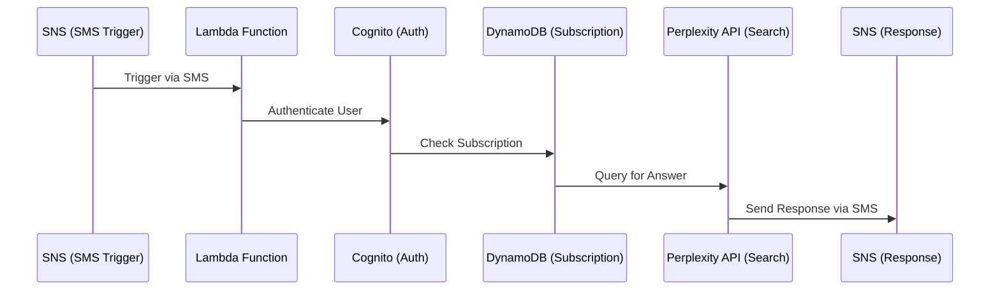

# Text It Search It SMS AI Search AWS Lambda 
This AWS Lambda function powers the core functionality of **Text It Search It (Tisi)**, an SMS-based AI search service. It processes incoming SMS messages from users, handles specific keywords (like STOP, HELP, JOIN) complying with international SMS messaging poliicies, authorizes users by seeing if they're phone numbers are verified via AWS Cognito, queries the Perplexity.ai Sonar API for responses, and sends answers back via SMS using AWS SNS. The function ensures user privacy and subscription management with DynamoDB integration only holding the details needed to provide a search service and not storing the users' queries or the responses they receive from the AI.

## Overview
Tisi allows users to send questions via SMS and receive real-time AI-generated answers, minimizing screen time and promoting a digital minimalist lifestyle. This Lambda function is triggered by incoming SMS messages through Amazon SNS, validates user authorization, processes commands, and integrates with external APIs for search capabilities.

## Features
- **SMS Processing**: Receives and processes SMS messages from users via Amazon SNS.
- **Keyword Handling**: Manages commands like `STOP` (opt-out), `HELP` (information), and `JOIN` (reactivate subscription).
- **User Authorization**: Validates users through AWS Cognito and checks subscription status in DynamoDB.
- **AI Search Integration**: Queries the Perplexity AI API to fetch real-time answers for user questions.
- **Response Delivery**: Sends cleaned, concise responses back to users via SMS using AWS SNS.
- **Privacy Focus**: Ensures minimal data retention and respects user opt-out preferences.

## Architecture

## File Structure
```
tisi-sms-search-service/
├── src/
│ └── lambda_function.py # Main Lambda function 
├── lambda-tests/
│ └── subscribed_user_test.json # Sample SNS event for testing the SMS sending to subscribed userbase
│ └── unsubscribed_user_test.json # Sample SNS event for testing the denial of unsubscribed userbase
├── request_layer.zip # Python dependency that imports re pip package to AWS Layer
└── README.md # This documentation file
```
## Requirements

- **AWS CLI**: Configured with appropriate permissions.
- **Python 3.13**: Runtime for the Lambda function.
- **Dependencies**: Zipped and installed as an AWS Layer underneath the Lambda (e.g., `boto3`, `urllib3`, 're').

### AWS Services Used
- **Amazon SNS**: For receiving and sending SMS messages.
- **AWS Cognito**: For user authentication and verification.
- **Amazon DynamoDB**: For storing user subscription data.
- **AWS Lambda**: For processing SMS requests and responses.

## Installation and Setup
### Prerequisites
- AWS account with permissions for Lambda, SNS, Cognito, and DynamoDB.
- Configured environment variables (see below).

### Deployment Information
This code is provided for viewing purposes only under a restricted license. For deployment details or usage, please contact the repository owner. General deployment steps involve packaging the code with dependencies and uploading it to AWS Lambda.

## Usage

### Trigger
The function is triggered by an SNS event when a user sends an SMS to a designated Tisi phone number.

### Event Format
A sample SNS json event for testing is provided in `lambda-tests/subscribed_user_test.json`:
```
{
  "Records": [
    {
      "Sns": {
        "Message": "{\"originationNumber\":\"+1234567890\",\"destinationNumber\":\"+13456175743\",\"messageBody\":\"How old is the rosary\"}",
        "Type": "Notification",
        "TopicArn": "arn:aws:sns:[AWS_REGION]:[AWS_USER_ID]:PerplexityIncomingMessages"
      }
    }
  ]
}
```
**Successful Reponse:**
```
Status: Succeeded
Test Event Name: subscribed_user_test

Response:
{
  "statusCode": 200,
  "body": "\"Message processed successfully\""
}

Function Logs:

[INFO]	2025-06-11T02:00:37.565Z	dc5d5ac7-dc2c-4e46-a6ad-d89e88b21191	Perplexity API response status: 200
[INFO]	2025-06-11T02:00:37.566Z	dc5d5ac7-dc2c-4e46-a6ad-d89e88b21191	Perplexity API response content: {"id": "b5d1dac8-2be3-47bf-8e18-e7827e93790c", "model": "sonar", "created": 1749607237, "usage": {"prompt_tokens": 34, "completion_tokens": 60, "total_tokens": 94, "search_context_size": "low"}, "message": {"role": "assistant", "content": "The rosary's roots date back thousands of years, with prayer beads used in ancient times. The modern rosary form developed between the 12th and 16th centuries. The name \"rosary\" was first recorded in 1597, but its origins are tied to earlier prayer practices."}, "delta": {"role": "assistant", "content": ""}}
[INFO]	2025-06-11T02:00:37.566Z	dc5d5ac7-dc2c-4e46-a6ad-d89e88b21191	Perplexity API response: The rosary's roots date back thousands of years, with prayer beads used in ancient times. The modern rosary form developed between the 12th and 16th centuries. The name "rosary" was first recorded in 1597, but its origins are tied to earlier prayer practices.
[INFO]	2025-06-11T02:00:37.566Z	dc5d5ac7-dc2c-4e46-a6ad-d89e88b21191	Cleaned response: The rosary's roots date back thousands of years, with prayer beads used in ancient times. The modern rosary form developed between the 12th and 16th centuries. The name "rosary" was first recorded in 1597, but its origins are tied to earlier prayer practices.
[INFO]	2025-06-11T02:00:37.566Z	dc5d5ac7-dc2c-4e46-a6ad-d89e88b21191	Attempting to send SMS to +1234567890 from +13456175743
[INFO]	2025-06-11T02:00:37.604Z	dc5d5ac7-dc2c-4e46-a6ad-d89e88b21191	SMS sent successfully from +13456175743. MessageId: 11bcd612-a982-5a4f-89b2-b6d04c07a5f2
[INFO]	2025-06-11T02:00:37.604Z	dc5d5ac7-dc2c-4e46-a6ad-d89e88b21191	Message processed successfully
[INFO]	2025-06-11T02:00:37.604Z	dc5d5ac7-dc2c-4e46-a6ad-d89e88b21191	Lambda function execution completed
END RequestId: dc5d5ac7-dc2c-4e46-a6ad-d89e88b21191
```
### Functionality
- **Keyword Processing**: Handles `STOP`, `HELP`, and `JOIN` commands without querying the AI API.
- **Authorization**: Checks if the user is verified in Cognito and has an active subscription in DynamoDB.
- **AI Query**: Sends user questions to Perplexity AI and cleans the response for SMS delivery.
- **Response**: Sends the AI-generated answer back to the user via SNS.

## Environment Variables
| Variable Name             | Description                                      |
|---------------------------|--------------------------------------------------|
| `PERPLEXITY_API_URL`      | URL endpoint for Perplexity AI API.             |
| `PERPLEXITY_API_KEY`      | API key for authenticating with Perplexity AI.  |
| `COGNITO_USER_POOL_ID`    | AWS Cognito User Pool ID for user auth.         |
| `DYNAMODB_TABLE_NAME`     | DynamoDB table name for user data storage.      |

## DynamoDB Schema
The function interacts with a DynamoDB table (specified by `DYNAMODB_TABLE_NAME`) with the following key attributes:
- `id` (String): Primary key for user records.
- `cognitoId` (String): Maps to Cognito user’s `sub` attribute.
- `subscriptionStatus` (String): User’s subscription state (`active`, `inactive`, 'cancelled').
- `servicePhoneNumber` (String, optional): Assigned Tisi service number for the user.

## Error Handling
- **Unauthorized Access**: Returns a 403 status if the user is not verified or doesn't have an active subscription.
- **API Timeouts/Errors**: Handles Perplexity API timeouts with a retry logic (3 attempts) and returns user-friendly error messages.
- **Logging**: Comprehensive logging to CloudWatch for debugging and monitoring.

## Best Practices Followed
- **Environment Reuse**: AWS clients (`sns`, `cognito`, `dynamodb`) are initialized outside the handler for reuse across invocations.
- **Environment Variables**: Operational parameters (API keys, IDs) are stored as environment variables.
- **Idempotent Design**: Keyword handling and subscription updates are designed to handle duplicate events gracefully.
- **Error Handling**: Robust try-except blocks to prevent crashes and logging errors to analyze any crashes that occur.

## License
This project is provided under a [restricted license](https://github.com/jcswanson/tisi-sms-service?tab=License-1-ov-file) for viewing purposes only. Unauthorized use, modification, distribution, or deployment of this code is prohibited. For permissions or licensing inquiries, please contact the repository owner.

## Support
For questions or inquiries about the code or service email the Text It Search It developer and founder [John Swanson](mailto:john@textitsearchit.com)
---
**Last Updated**: June 10, 2025  
**Version**: 1.0.2  
